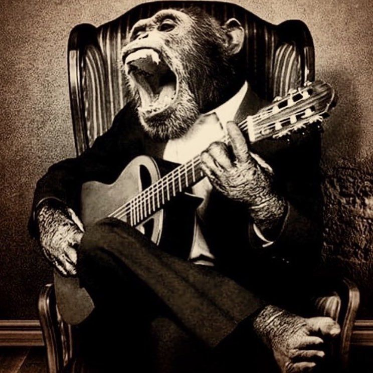

# MonkeBot



A Monkey bot able to play music and do some retarded things on Discord ! 🐒

_Based on [ZerioDev](https://github.com/ZerioDev) Music-Bot._

[Let MonkeBot join your server !](https://discord.com/api/oauth2/authorize?client_id=895225153955463219&permissions=0&scope=bot)

### ⚡ Configuration

Open the configuration file located in the main folder `config.js`.

```js
module.exports = {
    app: {
        px: 'XXX',
        token: 'XXX',
        playing: 'by Zerio ❤️'
    },

    opt: {
        DJ: {
            enabled: false,
            roleName: 'XXX',
            commands: []
        },
        maxVol: 100,
        loopMessage: false,
        discordPlayer: {}
    }
};
```

Basic configuration

- `app/px`, the prefix that will be set to use the bot
- `app/token`, the token of the bot available on the [Discord Developers](https://discordapp.com/developers/applications) section
- `app/playing`, the activity of the bot

DJ mode configuration

- `opt/DJ/enabled`, whether the DJ mode should be activated or not 
- `opt/DJ/roleName`, the name of the DJ role to be used
- `opt/DJ/commands`, the list of commands limited to members with the DJ role

Advanced configuration

- `opt/maxVol`, the maximum volume that users can define
- `opt/loopMessage`, if the message that a music is played should be sent when it is looped
- `opt/discordPlayer`, options used by discord-player

### 📑 Installation

To use the project correctly you will need some tools.

[FFmpeg](https://www.ffmpeg.org) to process audio

[Node JS](https://nodejs.org/en/) (v16) for environment

